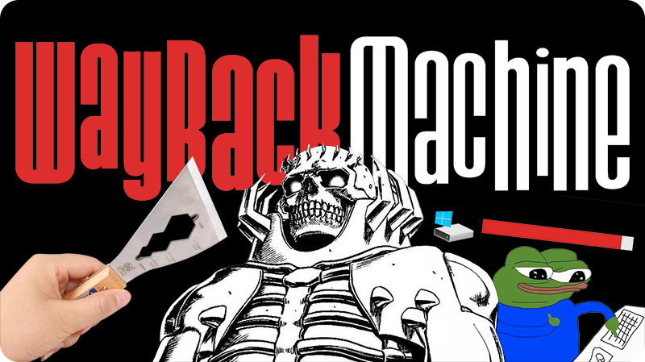
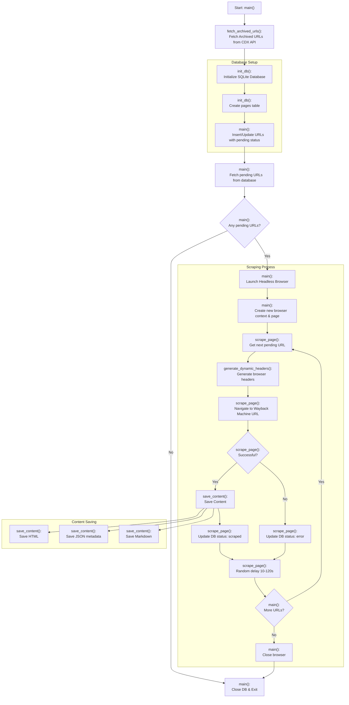

<p align="center">
  
</p>

<p align="center">
	<h1 align="center"><b>scruna-wb</b></h1>
<p align="center">
    Tuna's Wayback Scraper
    <br />
    <br />
    <a href="https://x.com/tunahorse21">@tunahorse21</a>
    ·
    <a href="https://x.com/alxfazio">@alxfazio</a>
  </p>
</p>

> This project contains derivative content based on code found in [Tuna's](https://x.com/tunahorse21) article ["Web scraping in 2024: pt2 actually scraping"](https://tuna.cat/posts/web-scraping-2024-pt2/).

## Overview
This project is a specialized web scraper designed to preserve and archive historical forum content using the Internet Archive's Wayback Machine. Instead of scraping a live website directly, it leverages the Wayback Machine's extensive archive to:
1. Access historical versions of web pages that might no longer be available
2. Retrieve content from a specific domain (`<TARGET_DOMAIN>`) across different points in time
3. Ensure data consistency and integrity through verified snapshots

The Wayback Machine serves as a reliable intermediary, providing:
- Timestamped snapshots of web pages
- A structured API for discovering archived content
- Verified copies of pages as they appeared at specific points in time
- Legal and ethical access to historical web content

The scraper systematically:
1. Queries the Wayback Machine's CDX API to discover archived pages
2. Retrieves the most recent snapshot of each unique URL
3. Processes and stores the content in multiple formats (HTML, JSON metadata, and Markdown)
4. Tracks progress using a local SQLite database

This approach ensures reliable archival of web content while respecting rate limits and maintaining data integrity.

## Features
- Retrieves historical snapshots from the Wayback Machine
- Saves content in three formats: HTML, JSON metadata, and Markdown
- Uses a SQLite database to track scraping progress
- Implements polite scraping with random delays
- Handles errors gracefully
- Provides browser-like request headers to avoid blocking

## Prerequisites
- Python 3.11 or higher
- Poetry (for dependency management)

## Installation

1. Clone the repository
```bash
git clone <repository-url>
cd <project-directory>
```

2. Install dependencies using Poetry
```bash
poetry install
```

3. Install Playwright browsers
```bash
poetry run playwright install chromium
```

## Project Structure

```
.
├── main.py           # Main scraper implementation
├── data_exp.py       # Data exploration utilities
├── scraper.db        # SQLite database (auto-generated)
├── scraped_data/     # Output directory for scraped content
│   ├── *.html        # Raw HTML files
│   ├── *.json        # Metadata files
│   └── *.md          # Markdown versions
└── pyproject.toml    # Project dependencies and configuration
```

## How It Works

### Process Flow


### 1. URL Collection
- Queries the Wayback Machine's CDX API to get all archived URLs for the domain (`fetch_archived_urls`)
- Filters for successful responses (HTTP 200) (`fetch_archived_urls`)
- Keeps only the most recent version of each URL (`fetch_archived_urls`)

### 2. Database Management
- Uses SQLite to track scraping progress (`init_db`)
- Schema:
  - `url`: The target URL (PRIMARY KEY)
  - `timestamp`: Wayback Machine timestamp
  - `status`: Current status (pending/scraped/error)

### 3. Scraping Process
The scraper follows this workflow:

1. **Initialization**
   - Fetches archived URLs (`main`)
   - Sets up database (`main`)
   - Marks all URLs as 'pending' (`main`)

2. **Browser Setup**
   - Launches headless Chromium browser (`main`)
   - Creates new context and page (`main`)

3. **For Each URL**
   - Generates dynamic browser-like headers (`generate_dynamic_headers`)
   - Navigates to Wayback Machine URL (`scrape_page`)
   - Implements random delays (10-120 seconds) (`scrape_page`)
   - Updates status in database (`scrape_page`)

4. **Content Saving**
   For each successfully scraped page:
   - Saves raw HTML (`save_content`)
   - Extracts and saves metadata (title, description) as JSON (`save_content`)
   - Converts content to Markdown (`save_content`)

### 4. Error Handling
- Implements timeouts for page loads (`scrape_page`)
- Marks failed URLs with 'error' status (`scrape_page`)
- Continues processing remaining URLs after errors (`scrape_page`)

## Output Formats

1. **HTML Files**
   - Raw HTML content exactly as archived
   - Filename: `{url_safe_name}.html`

2. **JSON Metadata**
   - URL
   - Page title
   - Meta description
   - Filename: `{url_safe_name}.json`

3. **Markdown**
   - Converted HTML content
   - Preserves basic formatting
   - Filename: `{url_safe_name}.md`

## Data Exploration
The project includes a data exploration script (`data_exp.py`) that allows you to:
- View database tables
- Check scraping status
- Open scraped HTML files in browser
- Review successful and failed scrapes

## Configuration
Key settings in `main.py`:
```python
DOMAIN = '<TARGET_DOMAIN>'
OUTPUT_DIR = 'scraped_data'
```

## Rate Limiting
To respect server resources and avoid blocking:
- Random delays between requests (10-120 seconds)
- Browser-like headers
- Single-threaded processing
- Proper user agent strings

## Error States
The scraper handles several error conditions:
- Network timeouts
- Invalid HTML content
- Missing pages
- Server errors

## Notes
- All scraped data is stored in the `scraped_data` directory
- The SQLite database (`scraper.db`) maintains state between runs
- The scraper can be safely stopped and resumed
- Progress is logged to stdout

## Limitations
- Single-domain focused
- Sequential processing only
- Requires stable internet connection
- May be affected by Wayback Machine availability

## Contributing
1. Fork the repository
2. Create a feature branch
3. Commit changes
4. Push to the branch
5. Create a Pull Request

## License

This project is licensed under the [MIT](https://opensource.org/licenses/MIT) License - see the [LICENSE](LICENSE) file for details.

## Disclaimer

*It is the sole responsibility of the end users to respect websites' policies when scraping, searching, and crawling with Web Archive Scraper. Users are advised to adhere to the applicable privacy policies and terms of use of the websites prior to initiating any scraping activities. By default, Web Archive Scraper respects the directives specified in the websites' robots.txt files when crawling. By utilizing Web Archive Scraper, you expressly agree to comply with these conditions.*

[↑ Back to Top ↑](#Web-Archive-Scraper)

Copyright (c) 2024-present, Alex Fazio