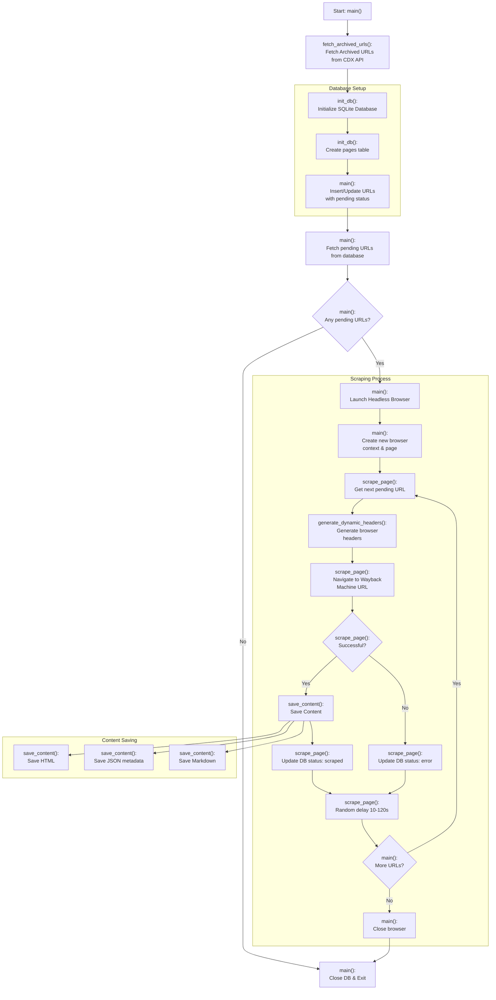

# Scraper Flowchart

```mermaid
flowchart TD
    A["Start: main()"] --> B["fetch_archived_urls():
    Fetch Archived URLs from CDX API"]
    B --> C["init_db():
    Initialize SQLite Database"]
    
    subgraph DB_Setup["Database Setup"]
        C --> D["init_db():
        Create pages table"]
        D --> E["main():
        Insert/Update URLs with pending status"]
    end

    E --> F["main():
    Fetch pending URLs from database"]
    F --> G{"main():
    Any pending URLs?"}
    
    G -->|No| H["main():
    Close DB & Exit"]
    G -->|Yes| I["main():
    Launch Headless Browser"]
    
    subgraph Scraping["Scraping Process"]
        I --> J["main():
        Create new browser context & page"]
        J --> K["scrape_page():
        Get next pending URL"]
        
        K --> L["generate_dynamic_headers():
        Generate browser headers"]
        L --> M["scrape_page():
        Navigate to Wayback Machine URL"]
        
        M --> N{"scrape_page():
        Successful?"}
        
        N -->|Yes| O["save_content():
        Save Content"]
        O --> P["scrape_page():
        Update DB status: scraped"]
        
        N -->|No| Q["scrape_page():
        Update DB status: error"]
        
        P --> R["scrape_page():
        Random delay 10-120s"]
        Q --> R
        
        R --> S{"main():
        More URLs?"}
        S -->|Yes| K
        S -->|No| T["main():
        Close browser"]
    end
    
    T --> H

    subgraph Saving["Content Saving"]
        O --> O1["save_content():
        Save HTML"]
        O --> O2["save_content():
        Save JSON metadata"]
        O --> O3["save_content():
        Save Markdown"]
    end
```
